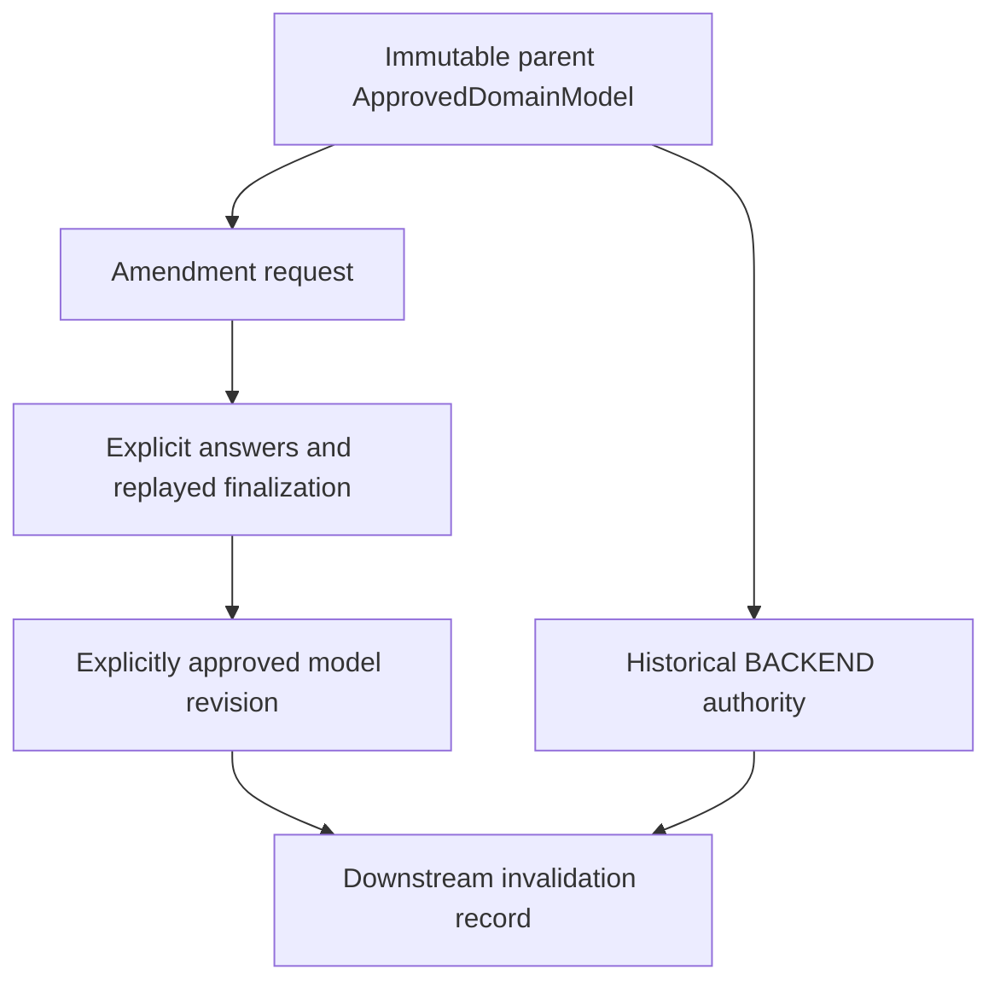

# Model authority refinement

For the first genuine Gaming Studio intent and IDEA checkpoint, see
[Gaming Studio production authority](GAMING_STUDIO_PRODUCTION_AUTHORITY.md).
The refinement histories below use TEST FIXTURE ONLY Gaming Studio authority;
they do not supply a production model parent. Production still has no model authority.

## Refinement 1: amendment foundation

`arcadev.model_amendment_request`, version 1, freezes the complete certified
ApprovedDomainModel. Its parent package transitively freezes the model
finalization, ArchitectureModelsHandoff, ApprovedArchitecture and project.
The request repeats model, finalization and project identities and reconstructs
every question from that exact parent on load. Caller-supplied parent content
must match exactly. Content hashes provide integrity, not signer authentication.
Trusted callers remain responsible for identifying the current approved parent.

Historical ApprovedDomainModel and question-backed proposal semantics remain
unchanged. Answering an old model question never approves its proposed fields.
New amendment questions require a complete explicit declaration with an exact
accepted decision and claim, architecture sources and an existing entity scope.
Names are never supplied by question generation. Persistent identities,
lifecycle domains, principal, external and outcome references are covered.
Every target includes the named-field area together with its specific logical
purpose. Lifecycle targets also include value-domain binding so that a single
complete declaration authorizes both atomically. These areas do not grant open
permission to add unrelated state. Lifecycle declaration includes an explicit domain name
and exact accepted values. No new defaults or physical mapping are supported.

Provider-neutral adapters return untrusted complete suggestions. Only the
strict candidates envelope is accepted; provider/approval/execution metadata,
unknown keys, credentials, paths, malformed or oversized JSON are rejected.
Suggestions affect request identity but grant no field authority. The read-only
review function displays suggestions as NON_AUTHORITATIVE and retains the
parent's original approval statement, including any test-fixture designation.

No downstream authority is rebuilt or changed. No application is generated.

The read-only CLI is `python -m tools.model_amendment_review PARENT_JSON`.
It requires an external certified parent and prints a deterministic review packet.
`tools/run_model_refinement_gates.py --output EXTERNAL_REPORT_DIRECTORY` discovers
the complete repository suite, partitions every test exactly once across up to
six module-preserving unittest workers, and records manifests, logs, counts and
skip reasons. A nonzero worker exit or mismatched count fails the gate. The
runtime-harness module runs serially after the shards because it asserts real
two-second process startup deadlines. Its assertions are unchanged. Existing
regression tests exercise generators only in isolated test workspaces.

## Gaming Studio production availability

**BLOCKED_PENDING_PRODUCTION_PARENT_AUTHORITY**

There is no persisted production Gaming Studio ApprovedDomainModel or downstream
production authority package. Existing Gaming Studio helpers are TEST FIXTURE
ONLY and must never be relabeled as production. No production amendment request,
answer, approval or authoritative review packet is created by this batch.
Production-specific question counts and field choices are unavailable until a
real certified parent is supplied. Generic lifecycle certification uses only
the existing test authority, which has five entities and 14 amendment questions.

### Refinement 1 certification

The dedicated suite has nine tests. Complete discovery exercised 1,212 tests:
1,209 initial passes, one existing opt-in Docker skip, and two rechecked failures.
The runtime harness exceeded its two-second startup deadline under worker load;
the generation fixture detected an edit to the gate helper during its source
snapshot. Both affected areas passed a 20-test recheck with unchanged assertions.
No historical implementation was changed. Later gates run the runtime harness
serially and keep source files fixed throughout the run. PostgreSQL runtime,
migration, and migration-execution suites passed. Docker is unavailable here.

## Refinement 2: explicit field and identity resolution

`arcadev.model_amendment_answer` and `arcadev.model_amendment_finalization` are
version 1 contracts. An answer requires an explicit `accept` action, unchanged
user text, a verbatim complete JSON declaration quoted in that text, and the
deterministically normalized field declaration. Every declaration attribute,
including null domain/default semantics and exact source decision/claim, must
match the quote. The answer binds request, parent approval, current finalization,
question and entity. Trusted caller authentication is external; these inert
records preserve explicit-user provenance but are not digital signatures.

Accepted declarations create ordinary logical ModelField records with
revision-only ModelAmendmentFieldEvidence. That evidence preserves the quoted
declaration, architecture sources, exact accepted source choice, amendment
decision ID and question ID. Old ModelFact loaders deliberately reject this new
evidence shape; it cannot masquerade as historical architecture approval.
Field IDs reuse `model_element_id` with explicit name, frozen sources and entity
scope. Entity IDs and ownership never change.

Identity fields must have the accepted type and be required, scalar, immutable
and unique. Lifecycle ENUM declarations atomically create an explicitly named
ModelValueDomain with exactly the accepted values. Principal references remain
scalar EXTERNAL_IDENTIFIER fields; external and outcome reference types must
match accepted claim semantics. None of these operations adds persistence
entities, credentials, defaults, relationships or physical mappings.

Invalid attempts raise ValueError atomically. Duplicate normalized field names,
field IDs, domain names/IDs, wrong scope, contradictory types/classifications,
changed lifecycle values and stale parent/request/finalization targets fail.
Version 1 supports no REPLACE action. Every accepted answer remains in append-only
history, and loaders replay all history before trusting fields or readiness.
Readiness means every blocking amendment question is resolved with no conflicts;
it does not approve a revised model or change downstream authority.

The fixture uses 14 explicitly marked TEST FIXTURE ONLY answers: five identities,
five principal references, two lifecycle fields/domains, one external reference
and one outcome reference on the existing build entity. Fixture answers are
defined only in test helpers. Production code never imports those helpers.
The read-only review continues to show the unresolved request independently of
fixture finalization. Production remains BLOCKED_PENDING_PRODUCTION_PARENT_AUTHORITY;
there is no production request or authoritative production review packet.

Credential-bearing names, including bare or provider-specific token/secret
names, are rejected. A pre-existing bound lifecycle domain does not suppress
the amendment question when its named field is still missing. Domain reuse or
replacement is not inferred; each proposed domain declaration remains explicit
and duplicate domain identities/names are rejected.

The refinement 2 full gate passed all 1,228 discovered tests with zero failures
or errors and the one existing opt-in Docker skip. The final dedicated suites
also cover the bounded name and missing-lifecycle-field corrections.
The final dedicated run passed 26 tests: 10 foundation and 16 resolution tests.

## Refinement 3: revised approval and downstream invalidation

`arcadev.approved_domain_model_revision`, version 1, freezes the complete parent,
request, replay-validated finalization and history, revised logical model and
recomputed consistency. Its envelope freezes the explicit APPROVED or REJECTED
decision and unchanged approval statement with the complete package. Content
identity includes all of these values. Readiness alone grants no approval;
incomplete, inconsistent, conflicted or empty materialization cannot be approved.
An explicit rejection can preserve an incomplete review package.

RevisedLogicalModel keeps parent model/finalization IDs as historical source
handles and adds a content-derived revised_model_id. It retains every parent
entity ID, name, classification, ownership, accepted choice, field, relationship,
constraint and access requirement. Only explicitly accepted amendment fields,
identity bindings and lifecycle domains are added. Revision-only evidence and
all amendment decisions accompany the view. Loaders reconstruct the view and
consistency from replay; serialized derived fields never grant authority.

`arcadev.downstream_authority_invalidation`, version 1, records supersession
relative to an explicitly approved revision. It accepts exact supplied
ModelsBackendHandoff, BackendSpecification, BackendFinalization, ApprovedBackend,
ArcaCoreGenerationRequest and BackendGenerationRun objects. Nested packages
provide validation context, but only explicitly supplied top-level contracts
receive their corresponding stale reason codes. A standalone specification or
finalization requires its frozen handoff context. Mixed chains, unrelated
parents, forged content and rejected revisions fail closed.

Historical validators continue to recognize old records as valid history.
They cannot discover revisions that were never supplied to them. Consumers must
select current lineage externally and consult invalidation before execution;
`assert_current(kind, authority)` rejects exactly bound stale contracts and
rejects unevaluated replacements. It never grants new execution authority.
There is no global registry mutation, destructive invalidation, stage rewind,
new backend approval, new handoff or automatic generation in this lifecycle.

The historical BACKEND project remains unchanged. The parent architecture
handoff retains its canonical IN_PROGRESS/MODELS project as source lineage for
the **next controlled batch: revised MODELS → BACKEND authority rebuild**.
That rebuild and Sprint 32 are outside this batch.

Gaming Studio fixture certification can approve the five-entity revision and
mark the six supplied downstream fixture contracts stale. This is TEST FIXTURE
ONLY. Production remains **BLOCKED_PENDING_PRODUCTION_PARENT_AUTHORITY**; no
production amendment, answers, revised approval or authoritative review packet
exists or is fabricated by this batch.

The refinement 3 dedicated suite passed 21 tests. The final pre-commit run of
all three dedicated suites passed 47 tests (10 foundation, 16 resolution, 21
revision/invalidation) against the final implementation. Post-commit certification
reruns these suites, complete ArcaDev discovery, complete repository discovery,
and all seven PostgreSQL-backed test classes. The real Docker contract remains
an explicitly reported opt-in skip when Docker is unavailable.
